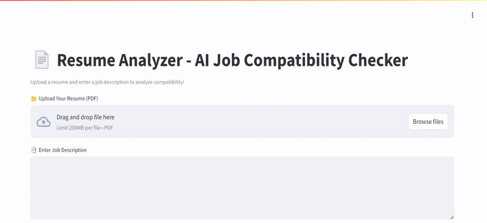

# 🚀 Resume Analyzer - AI-Powered Job Compatibility Checker
# 🎥 Demo  


🔹 This project allows users to upload a resume (PDF) and a job description, then analyzes the compatibility between them using a locally hosted Ollama LLM.

🔹 The model extracts technical skills (programming languages), soft skills, and missing qualifications and provides structured feedback for better job matching.


 
## 📌 Overview

1️⃣ Upload a Resume (PDF format)

2️⃣ Enter the Job Description

3️⃣ Extract Resume Text using PyPDF2

4️⃣ Send Resume + Job Description to Ollama

5️⃣ Analyze Compatibility:

🔍 Extract programming languages from both documents

🔍 Extract soft skills from both documents

🔍 Check missing skills

🔍 Provide improvement suggestions

🔍 Give an overall compatibility score (High/Medium/Low)

# 🛠 Tech Stack & Tools Used

Python 🐍

PyPDF2 (for extracting text from PDFs)

Ollama LLM (locally hosted for AI processing)

Google Colab (to run the project interactively)

# 🚀 Installation & Setup
## 1️⃣ Clone the Repository


## Installation

Clone the Repository

```bash
git clone https://github.com/your-username/resume-analyzer.git
cd resume-analyzer

```
Install Dependencies

```bash
pip install requests PyPDF2

```
Start the ollama

```bash
ollama serve

```

## 📧 Need Help?
If you have any questions, feel free to open an issue or contact me at 📩 chinmayvyawahare94036@example.com.


    
