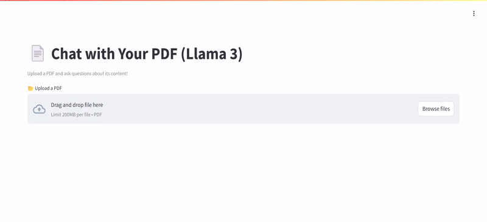

# 🚀 PDF Based Chat (Powered by Ollama LLM, SBERT & CrewAI)

📌 Chat with Your PDF is an AI-powered application that enables users to interact with PDF documents by asking questions and receiving context-aware responses. The system is powered by Llama 3 (via Ollama), SBERT (bi-encoder), and CrewAI, creating a seamless, intelligent document understanding experience.  

---

## 📌 Overview  

1️⃣ Upload a PDF – Users can upload a PDF document directly into the 
     application. 

2️⃣ Extract & Process Text – The AI extracts text from the PDF using PyMuPDF (fitz).

3️⃣ Find the Most Relevant Section – The text is divided into chunks, and the most relevant section is retrieved using SBERT (bi-encoder similarity scoring).

4️⃣ Generate AI-Powered Answers – The selected chunk is sent to Llama 3 (Ollama API), which processes the question and generates a well-formulated response. 
  
5️⃣ Interactive Q&A – Users can ask multiple questions, and the AI will retrieve relevant sections from the PDF for each query.

---

## 🛠 Tech Stack & Tools Used  

✔ Python 🐍

✔ Streamlit (for UI)

✔ PyMuPDF (fitz) (for extracting text from PDFs)

✔ Sentence-Transformers (SBERT) (for semantic similarity and relevance ranking)

✔ Ollama LLM (Locally hosted for AI processing)

✔ CrewAI (for task and agent management)

✔ Torch (for tensor operations with SBERT)

✔ Requests (for API calls to Ollama)

---

# Use Cases

💼 Business Reports & Legal Documents – Quickly extract key information.

📚 Research Papers & Books – Ask questions about long academic PDFs.

📝 Contracts & Policies – Summarize and clarify complex documents.

🎓 Education & Learning – Help students understand course material.
